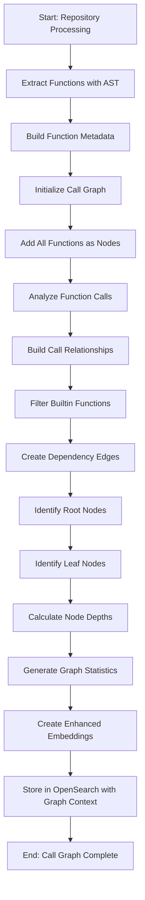
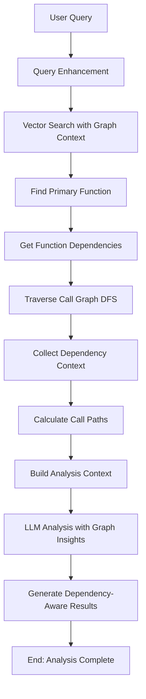

# Call Graph Analysis Flow

## Overview

The Call Graph Analysis approach builds comprehensive dependency graphs of function relationships, enabling deep analysis of code execution flows, dependency chains, and impact assessment.

## 1. Call Graph Construction Flow



## 2. Function Analysis with Call Graph Context



## 3. Call Graph Data Structures

### CallGraph Structure:
```
CallGraph {
    nodes: Dict[str, CallGraphNode]
    root_nodes: Set[str]           # Functions with no callers
    leaf_nodes: Set[str]           # Functions that call no others
    max_depth: int                 # Maximum call chain depth
}
```

### CallGraphNode Structure:
```
CallGraphNode {
    function_metadata: FunctionMetadata
    dependencies: Set[str]         # Functions this calls
    dependents: Set[str]          # Functions that call this
    depth_level: int              # Depth in call hierarchy
    visited: bool                 # For traversal algorithms
}
```

## 4. Detailed Process Steps

### Step 1: Graph Construction
1. **Function Extraction**
   - Parse repository using AST
   - Extract function metadata (calls, imports, decorators)
   - Create CallGraphNode for each function

2. **Relationship Building**
   - Analyze function calls in each function
   - Map function names to lookup IDs
   - Create edges between caller and callee functions
   - Filter out builtin Python functions

3. **Graph Analysis**
   - Identify root nodes (entry points)
   - Identify leaf nodes (terminal functions)
   - Calculate depth levels from root nodes
   - Generate comprehensive graph statistics

### Step 2: Enhanced Search
1. **Vector Similarity**
   - Create enhanced embeddings with graph context
   - Include dependency information in embeddings
   - Store graph metadata in OpenSearch

2. **Context Enrichment**
   - For each search result, get dependency context
   - Traverse graph using DFS with configurable depth
   - Include call paths and related functions

### Step 3: Analysis Generation
1. **Context Preparation**
   - Combine primary function with dependencies
   - Include call paths and graph insights
   - Add dependency statistics and relationships

2. **LLM Analysis**
   - Provide graph context to analysis service
   - Generate dependency-aware analysis
   - Include impact assessment and relationship insights

## 5. Key Advantages

### Relationship Mapping
- **Dependency Tracking**: See what functions call what
- **Impact Analysis**: Understand change propagation
- **Execution Flows**: Trace code execution paths
- **Critical Path Detection**: Identify important function chains

### Enhanced Search Context
- **Dependency Context**: Include related functions in analysis
- **Call Path Analysis**: Show how functions are reached
- **Graph Statistics**: Provide structural insights
- **Relationship Scoring**: Weight results by graph importance

## 6. Performance Characteristics

### Time Complexity
- **Graph Construction**: O(V + E) where V = functions, E = calls
- **DFS Traversal**: O(V + E) for each search
- **Path Finding**: O(V * E) in worst case

### Space Complexity
- **Graph Storage**: O(V + E) for adjacency lists
- **Enhanced Embeddings**: ~200MB for 1000 functions
- **Search Context**: O(depth * branching_factor) per query

## 7. Configuration Options

### Graph Construction
```python
CALL_GRAPH_CONFIG = {
    "max_depth": 3,                    # Maximum traversal depth
    "include_builtins": False,         # Filter builtin functions
    "cycle_detection": True,           # Detect recursive calls
    "min_confidence": 0.8              # Function call confidence threshold
}
```

### Search Configuration
```python
SEARCH_CONFIG = {
    "max_context_functions": 10,       # Max functions in context
    "depth_weight": 0.8,              # Weight by graph depth
    "relationship_boost": 1.2,         # Boost related functions
    "path_length_penalty": 0.9        # Penalize long call paths
}
```

## 8. Error Handling

### Graph Construction Errors
- **Circular Dependencies**: Detect and handle gracefully
- **Missing Functions**: Continue with partial graph
- **Parse Errors**: Skip problematic functions

### Search Errors
- **Graph Not Built**: Fall back to simple search
- **Traversal Timeout**: Limit depth and breadth
- **Memory Limits**: Implement pagination

## 9. Monitoring and Metrics

### Graph Quality Metrics
- **Coverage**: Percentage of functions in graph
- **Connectivity**: Average node degree
- **Depth Distribution**: Function depth histogram
- **Component Count**: Number of disconnected subgraphs

### Performance Metrics
- **Construction Time**: Graph building duration
- **Search Latency**: Query response time
- **Memory Usage**: Graph storage overhead
- **Context Quality**: Relevance of dependency context

## 10. Use Cases

- **Refactoring Impact**: Assess change consequences
- **Authentication Flows**: Trace security-critical paths
- **Error Propagation**: Follow exception handling chains
- **Performance Analysis**: Identify bottleneck functions
- **Code Review**: Understand function relationships
