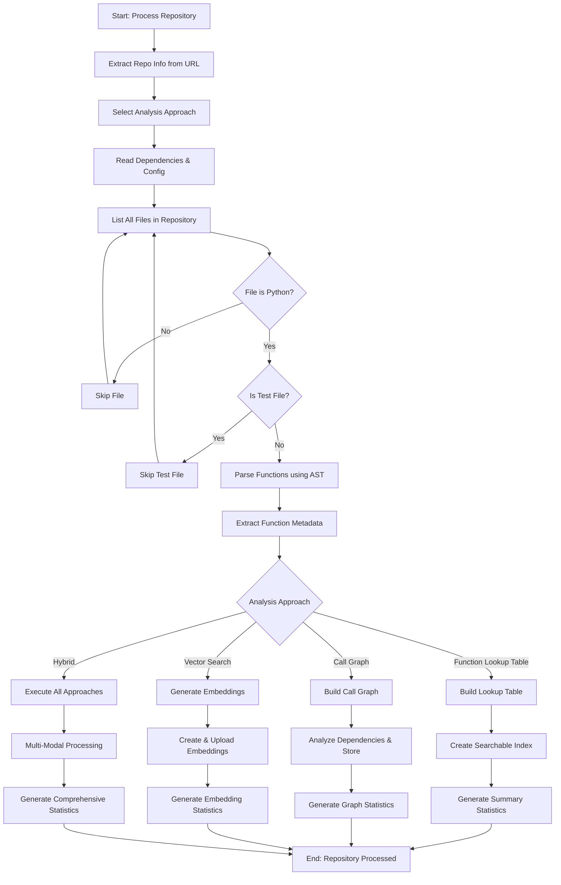
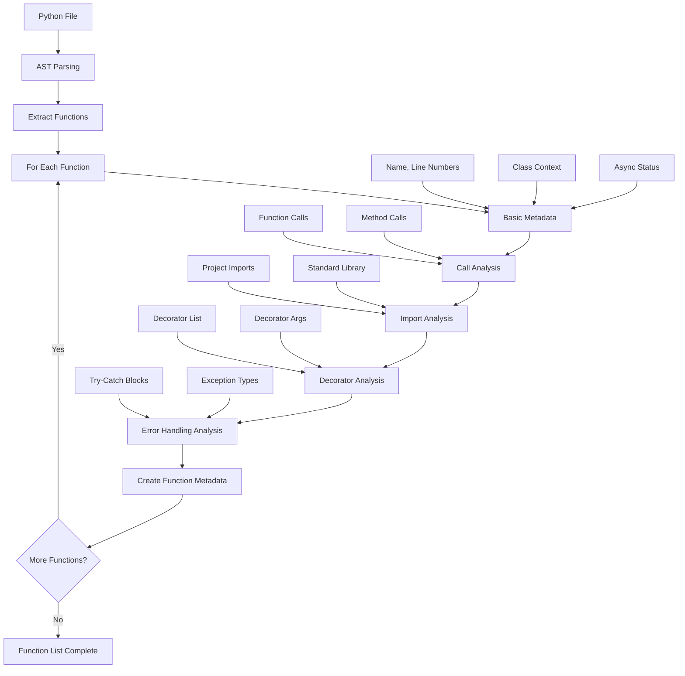
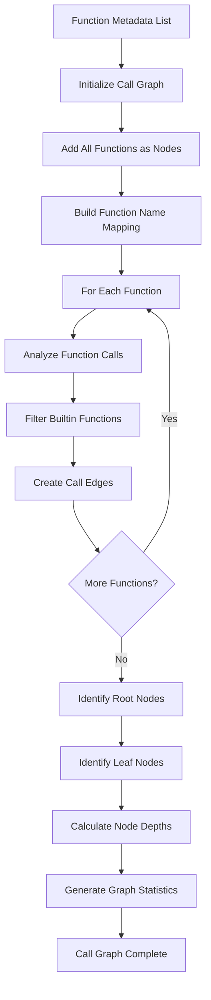
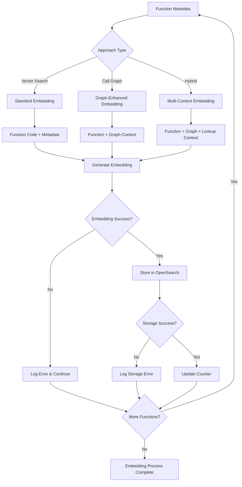
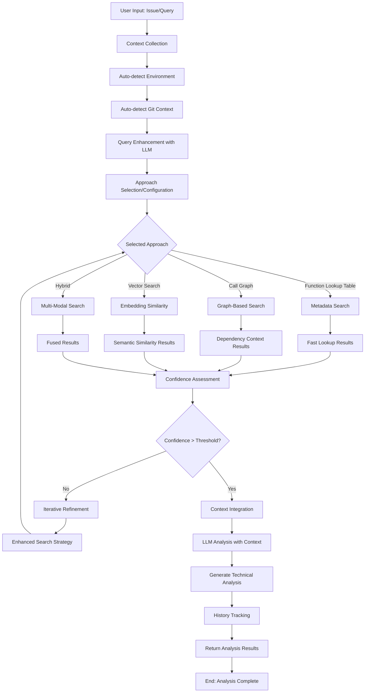

# Repository Processing and Analysis Flow

## Overview

This document describes the comprehensive flow for repository processing and user issue analysis, supporting multiple analysis approaches including Call Graph Analysis, Function Lookup Tables, Vector Search, and Hybrid approaches.

## 1. Repository Processing Flow (Multi-Approach)



## 2. Function Metadata Extraction (Enhanced)



## 3. Call Graph Construction Process



## 4. Enhanced Embedding Generation



## 5. Multi-Approach User Issue Analysis



## 6. Detailed Process Steps by Approach

### Function Lookup Table Approach:
1. **Index Creation**
   - Build searchable metadata index
   - Support filtering by multiple attributes
   - Create export capabilities (CSV/JSON)

2. **Fast Search**
   - Direct metadata matching
   - Pattern-based filtering
   - Instant results for exact matches

### Call Graph Approach:
1. **Graph Construction**
   - Build complete dependency graph
   - Calculate node depths and relationships
   - Identify critical paths and components

2. **Context-Aware Search**
   - Include dependency context in results
   - Provide call path analysis
   - Enable impact assessment

### Vector Search Approach:
1. **Embedding Generation**
   - Create semantic embeddings
   - Store in optimized OpenSearch index
   - Support k-NN similarity search

2. **Semantic Search**
   - Find conceptually similar functions
   - Cross-language pattern recognition
   - Context-aware similarity scoring

### Hybrid Approach:
1. **Parallel Execution**
   - Run multiple approaches simultaneously
   - Cross-validate results
   - Combine strengths of each method

2. **Result Fusion**
   - Intelligent result merging
   - Confidence-based weighting
   - Comprehensive analysis coverage

## 7. Enhanced Context Collection

### Automatic Context Detection:
```
Environment Context:
- OS, Python version, available memory
- Git branch, recent commits, repository info
- Error logs, performance metrics
- Technology stack, dependencies

Analysis Context:
- Query complexity assessment
- Historical similar queries
- Approach effectiveness patterns
- User preferences and feedback
```

## 8. Confidence Scoring and Quality Assessment

### Multi-Dimensional Confidence:
- **Search Relevance**: How well results match query
- **Context Completeness**: Adequacy of context information
- **Cross-Approach Agreement**: Consistency across methods
- **Historical Performance**: Success rate for similar queries

### Quality Metrics:
- **Coverage**: Percentage of relevant functions found
- **Precision**: Accuracy of returned results
- **Completeness**: Depth of analysis provided
- **Actionability**: Usefulness of recommendations

## 9. Advanced Error Handling

### Service-Level Errors:
- **LLM Service Failures**: Automatic fallback to alternative services
- **OpenSearch Unavailable**: Graceful degradation to in-memory search
- **Embedding Generation Errors**: Continue with available functions
- **Graph Construction Issues**: Partial graph with warnings

### Analysis-Level Errors:
- **Low Confidence Results**: Automatic refinement strategies
- **No Results Found**: Expanded search scope and alternative approaches
- **Context Overload**: Intelligent context truncation and prioritization
- **Inconsistent Results**: Cross-validation and conflict resolution

## 10. Performance Optimization Strategies

### Caching Layers:
- **Query Result Caching**: Cache frequent query results
- **Embedding Caching**: Reuse generated embeddings
- **Graph Structure Caching**: Persist call graph between sessions
- **Context Caching**: Store processed context information

### Parallel Processing:
- **Multi-Approach Execution**: Run approaches in parallel
- **Batch Processing**: Process multiple functions simultaneously
- **Async Operations**: Non-blocking I/O for external services
- **Resource Pooling**: Efficient resource utilization

## 11. Monitoring and Analytics

### Real-Time Metrics:
- **Processing Speed**: Repository analysis time
- **Search Latency**: Query response time
- **Success Rates**: Analysis effectiveness
- **Resource Usage**: Memory and CPU utilization

### Historical Analytics:
- **Approach Effectiveness**: Success rates by approach
- **Query Patterns**: Common query types and trends
- **User Satisfaction**: Feedback and usage patterns
- **System Performance**: Long-term performance trends
