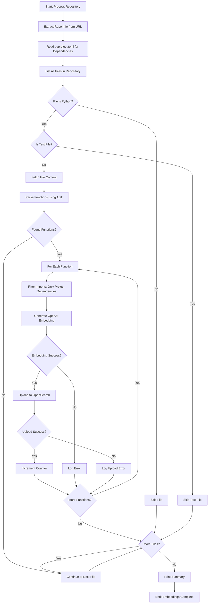
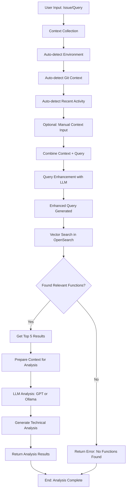

# Embedding Generation and User Issue Analysis Flow

## 1. Embedding Generation Process



## 2. User Issue Analysis Flow



## 3. Detailed Process Steps

### Embedding Generation Steps:
1. **Repository Processing**
   - Extract workspace and repo slug from Bitbucket URL
   - Read pyproject.toml to get project dependencies
   - List all files in repository recursively

2. **File Filtering**
   - Skip non-Python files (.py extension only)
   - Skip test files (patterns: test_, _test, tests/, spec_, etc.)
   - Track skipped files for summary

3. **Function Extraction**
   - Parse each Python file using AST
   - Extract function definitions with metadata
   - Get function code, line numbers, calls, imports, etc.

4. **Import Filtering**
   - Filter imports to only include project dependencies from pyproject.toml
   - Exclude standard library and external dependencies
   - Keep only relevant project imports

5. **Embedding Generation**
   - Create OpenAI embedding for each function
   - Include all metadata in embedding context
   - Handle API errors gracefully

6. **OpenSearch Upload**
   - Upload embedding with function metadata
   - Store code, calls, imports, line numbers, etc.
   - Handle upload errors gracefully

### User Issue Analysis Steps:
1. **Context Collection**
   - Auto-detect OS, Git branch, repo name
   - Auto-detect recent activity and memory usage
   - Optional manual context input (role, priority, etc.)

2. **Query Enhancement**
   - Use LLM to enhance user query with technical context
   - Preserve original terms and intent
   - Add architectural and pattern context

3. **Vector Search**
   - Search OpenSearch using enhanced query
   - Use k-NN to find most similar functions
   - Return top 5 relevant results

4. **LLM Analysis**
   - Prepare context with found functions
   - Use GPT or Ollama for technical analysis
   - Generate detailed issue analysis with line numbers

## 4. Key Data Flows

### Embedding Data:
```
Function Code + Metadata → OpenAI Embedding → OpenSearch Document
```

### Query Data:
```
User Query → Context Collection → Enhanced Query → Vector Search → LLM Analysis
```

### Context Data:
```
Environment + Git + Activity + Manual Input → Enhanced Query → Better Search Results
```

## 5. Error Handling Points

- **File Access Errors**: Skip files that can't be read
- **Parsing Errors**: Skip files that can't be parsed
- **Embedding Errors**: Log and continue with next function
- **Upload Errors**: Log and continue with next function
- **Search Errors**: Return appropriate error messages
- **LLM Errors**: Fall back to original query or return error

## 6. Performance Considerations

- **Batch Processing**: Process files one by one
- **Error Recovery**: Continue processing even if some items fail
- **Progress Tracking**: Show progress for large repositories
- **Memory Management**: Process functions individually to avoid memory issues 