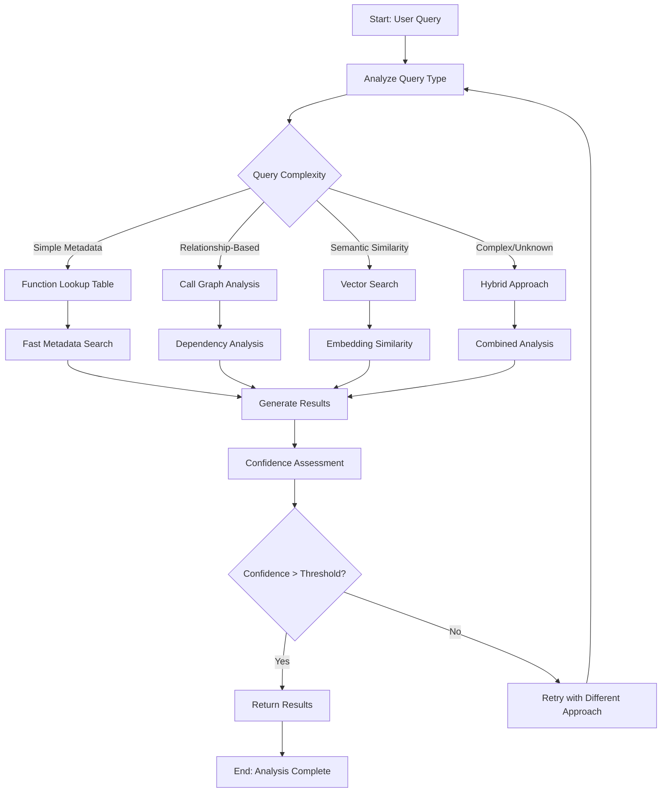
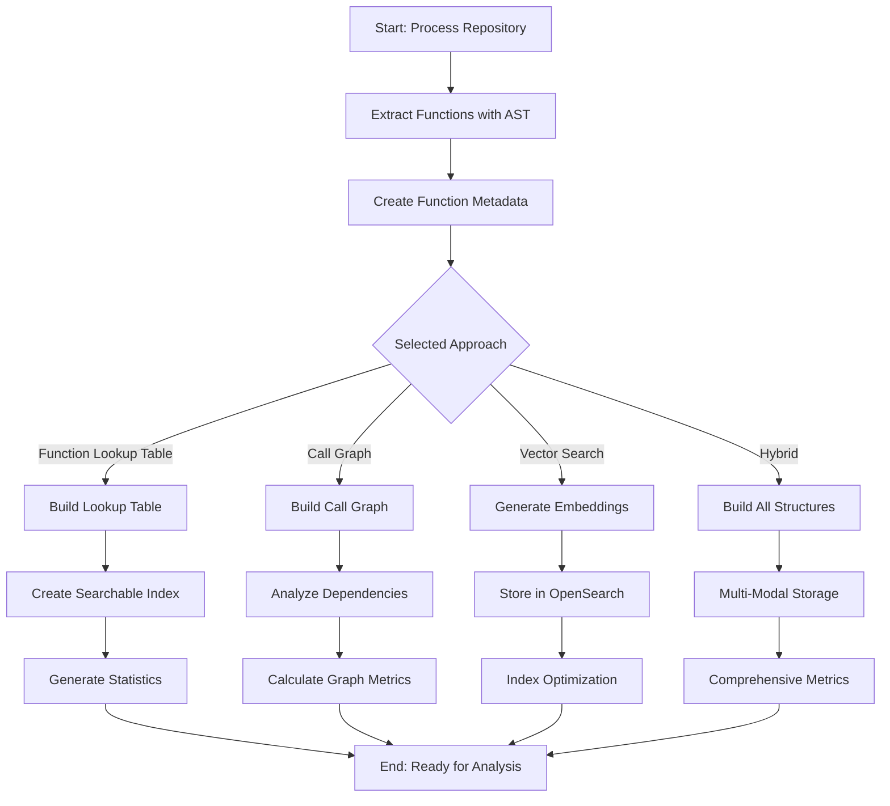
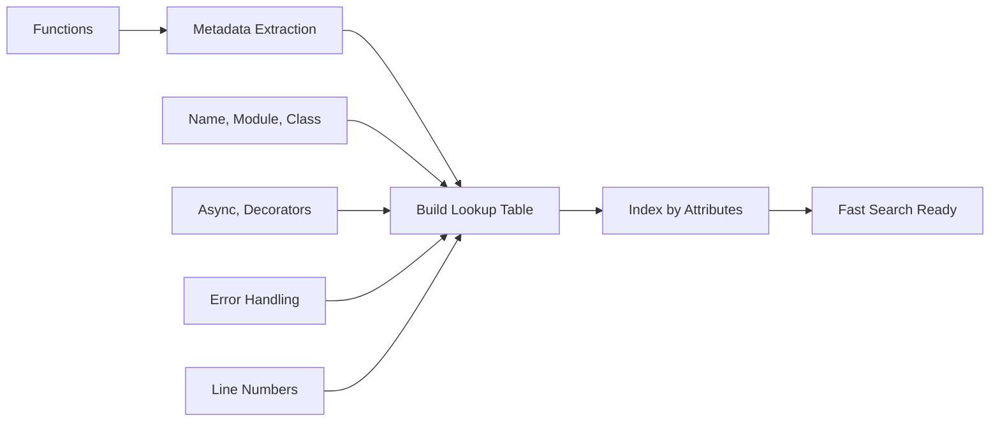
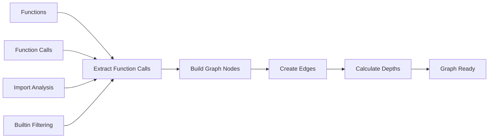
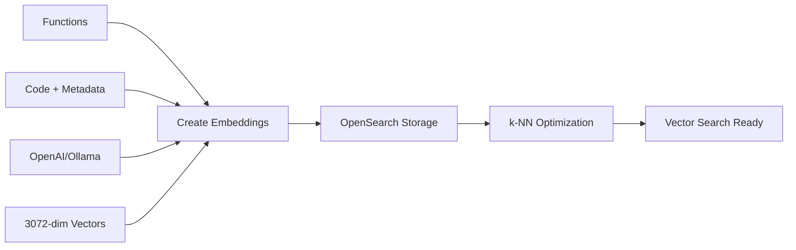
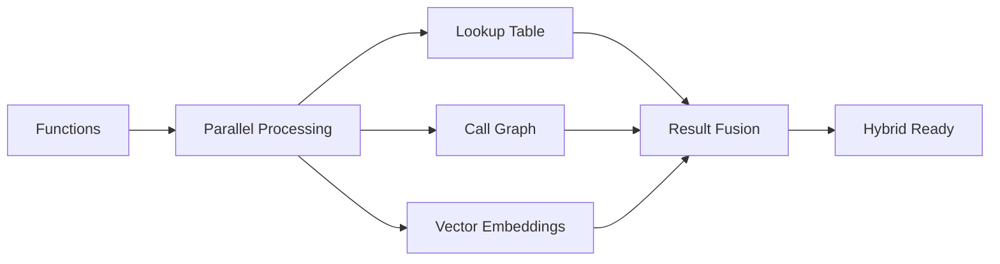
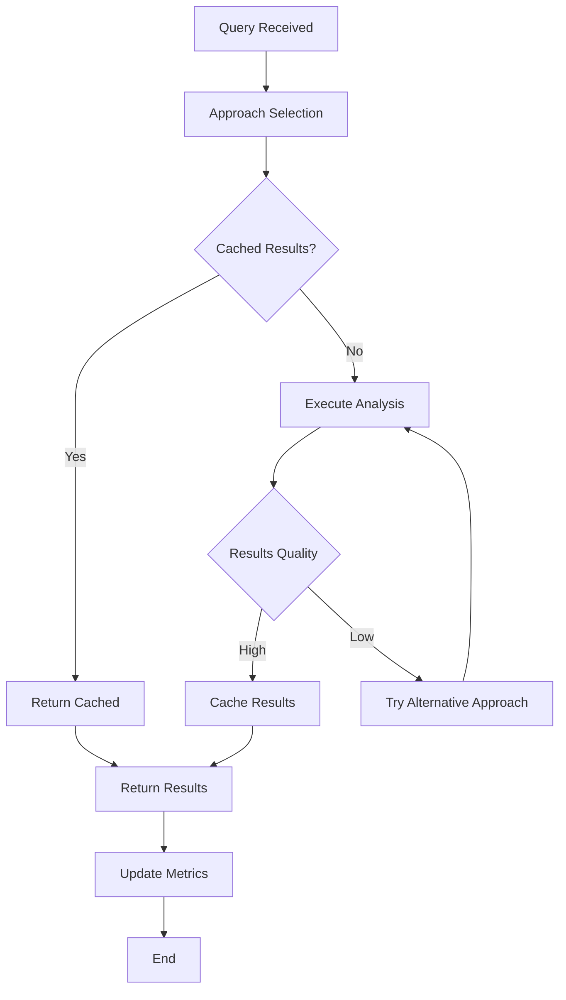
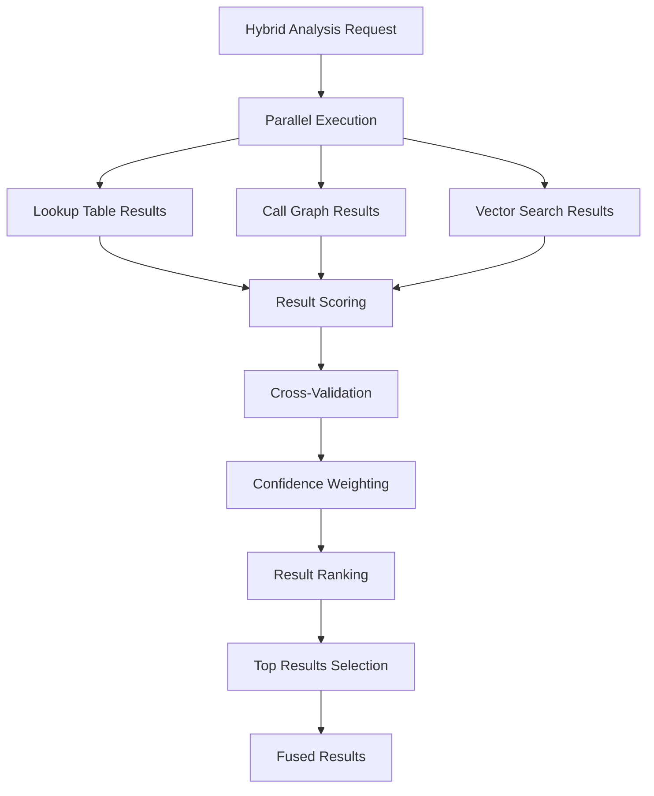

# Multi-Approach Analysis Flow

## Overview

The system supports four distinct analysis approaches that can be used individually or in combination. This flow documents how the system selects and executes different approaches based on the analysis requirements.

## 1. Approach Selection Flow



## 2. Repository Processing Flow by Approach



## 3. Approach-Specific Processing

### Function Lookup Table Approach


### Call Graph Approach


### Vector Search Approach


### Hybrid Approach


## 4. Query Analysis and Routing

### Query Classification
```python
def classify_query(query: str) -> AnalysisApproach:
    """Classify query to determine best approach"""
    
    # Metadata-based queries
    if has_exact_patterns(query):
        return AnalysisApproach.FUNCTION_LOOKUP_TABLE
    
    # Relationship-based queries  
    if has_dependency_keywords(query):
        return AnalysisApproach.CALL_GRAPH
    
    # Semantic queries
    if has_conceptual_terms(query):
        return AnalysisApproach.VECTOR_SEARCH
    
    # Complex/unknown queries
    return AnalysisApproach.HYBRID
```

### Approach Selection Criteria

| Query Type | Best Approach | Reasoning |
|------------|---------------|-----------|
| "Find function named 'authenticate'" | Lookup Table | Exact name matching |
| "What calls the login function?" | Call Graph | Dependency analysis |
| "Functions similar to user validation" | Vector Search | Semantic similarity |
| "Authentication issues in the system" | Hybrid | Complex, multi-faceted |

## 5. Performance Optimization Flow



## 6. Result Fusion for Hybrid Approach



## 7. Error Handling and Fallbacks

### Fallback Chain
```
Primary Approach Failed → Secondary Approach → Fallback Approach → Error Response
```

### Example Fallback Scenarios
- **Call Graph Failed** → Vector Search → Lookup Table → Error
- **Vector Search Failed** → Call Graph → Lookup Table → Error  
- **Hybrid Failed** → Best Individual Approach → Simple Search → Error

## 8. Monitoring and Metrics

### Per-Approach Metrics
- **Success Rate**: Percentage of successful analyses
- **Response Time**: Average query processing time
- **Confidence Score**: Average confidence of results
- **Cache Hit Rate**: Percentage of cached responses

### Cross-Approach Comparison
- **Accuracy Validation**: Compare results across approaches
- **Performance Benchmarks**: Speed and resource usage
- **User Satisfaction**: Feedback on result quality
- **Approach Selection**: Effectiveness of automatic selection
